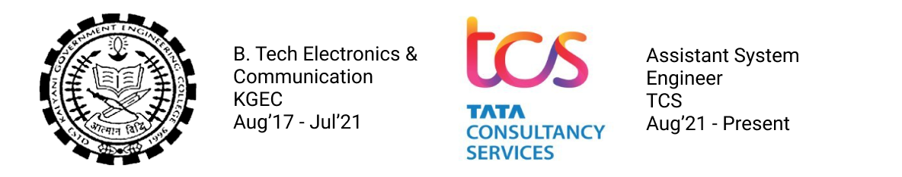

I am a recent engineering grad, who finished his bachelor’s degree in Electronics and Communication from **K**alyani **G**overnment **E**ngineering **C**ollege and graduated in the summer of 2021.

Currently, I am working for **Tata Consultancy Services** as _Assistant System Engineer_ (ASE).

My pronouns are **he/him/his**.

---

---

### My Research Interest
My research interests include but are not limited to: **computer vision** (object detection, event detection, video tracking, object recognition, 3D pose estimation, and image restoration), **machine learning** (deep learning, optimization algorithms and deep reinforcement learning), and **generative adversarial networks** (GAN).

I am also interested in robotics and systems with real world applications.

---

### My Background
I was born and raised in [Durgapur](https://en.wikipedia.org/wiki/Durgapur), India which is one of the fastest growing cities in India.

In 2017, I moved to Kalyani, India to join Kalyani Government Engineering College (one of the best college under West Bengal Uniservsity of Technology) where I graduated from as a ECE major in 2021.

In mid 2021, after I graduate I joined **Tata Consultancy Services** as an assistant system engineer and currently working with SAP CRM and various automation frameworks like Selenium etc. for manual and automation testing for e-commerce and retail applications

In my free time, I learn whatever musical instrument I can lay my hands on including but not limited to: Drums, Bansuri (Indian bamboo flute), keyboard, guitar and the ukulele.

---

### News

**[Aug 2021]** &ensp; Joined Tata Consultancy Services as an Assistant System Engineer (ASE)

